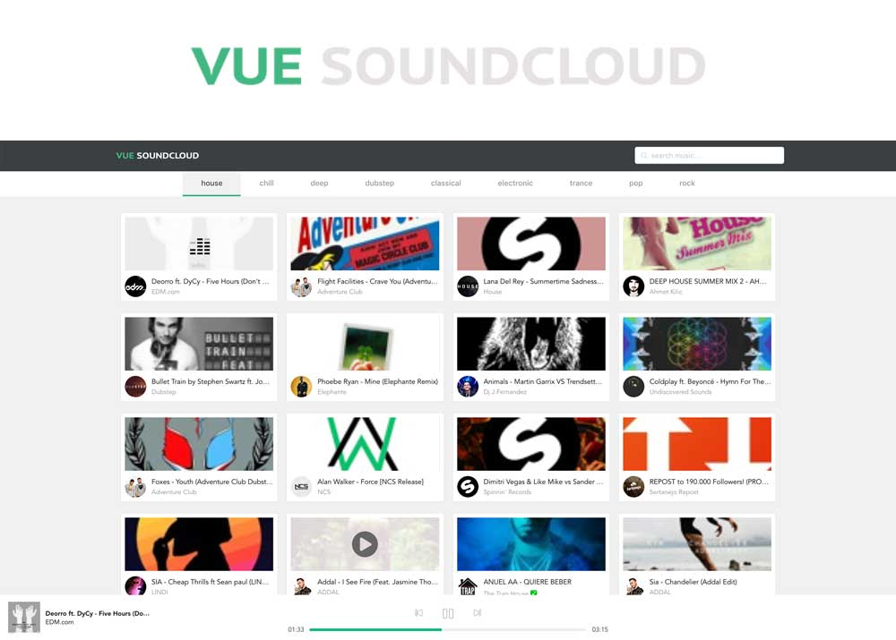

# Vue SoundCloud
This is a simple Soundcloud client built with `Vue.js 2`.

**NOTE** It seems that SoundCloud has revoked my api client keys without any explanation or warning. Running the app locally no longer works unless you have a working SoundCloud API client id (SoundCloud has disabled registration of new apps for quite some time now). The [live demo](https://vue-soundcloud.herokuapp.com) is also not working at the moment.

### I've implemented this project using the following technologies:
* [Vue](https://github.com/vuejs/vue)
* [Vuex](https://github.com/vuejs/vuex)
* [Axios](https://github.com/axios/axios)
* [Element](https://github.com/ElemeFE/element)
* [Howler](https://github.com/goldfire/howler.js)

### TODOS
-  Fix responsive issues
